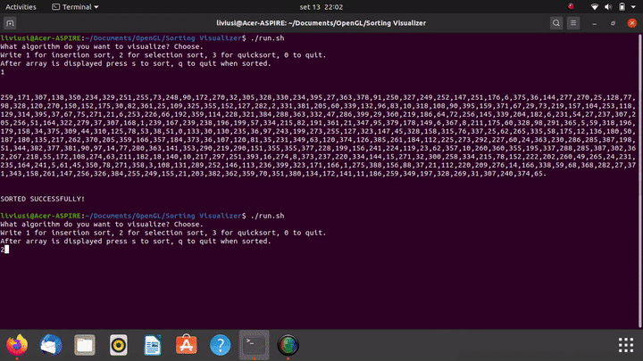
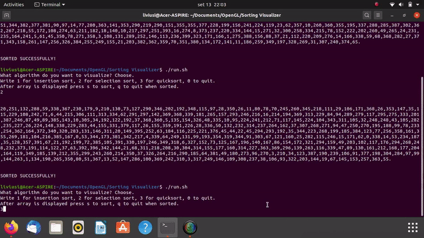

# Sorting Visualizer
This has been written as an exercise to try out OpenGL.

## How does it work?
It uses OpenGL to handle graphics. The implementations of the sorting algorithms are a version written in C of those in [this book](https://www.amazon.it/Introduction-Algorithms-Thomas-H-Cormen/dp/0262033844).

## How do I run it?
First of all you need to setup OpenGL and gcc for your operating system; then you can run:

    chmod +x run.sh
    ./run.sh

## Which sorting algorithms have been implemented?
1. [Insertion sort](https://en.wikipedia.org/wiki/Insertion_sort). 
2. [Selection sort](https://en.wikipedia.org/wiki/Selection_sort).
3. [Quicksort](https://en.wikipedia.org/wiki/Quicksort).

## Sorting at its finest

  
Insertion sort
  
This is the final result.  

  

  

  
Selection sort
  
This is the final result.  

  
Quicksort
  
This is the final result.  

